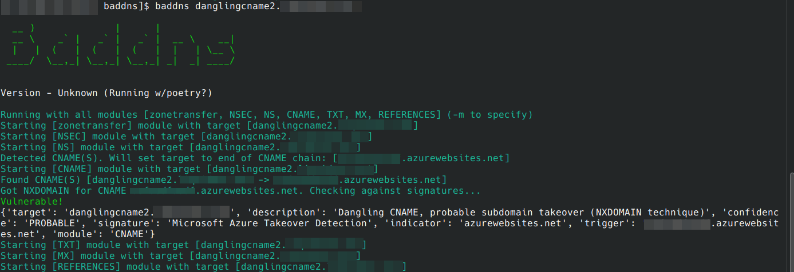
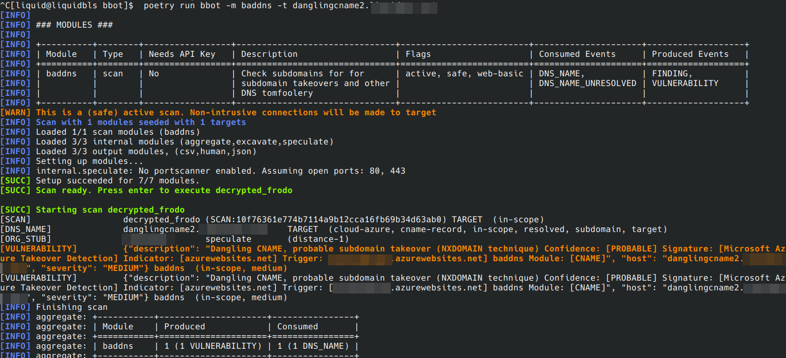

## What is BadDNS?

BadDNS is a library, supporting the detection of a a wide range of DNS related security issues. It is designed from day one to work within [BBOT](https://github.com/blacklanternsecurity/bbot), which allows you to utilize it at massive scale seamlessly as part of the domain discovery process. 

It's also a fully functional standalone command-line tool, useful for any time you want to assess a single domain.

## Modular

BadDNS is modular. This means new functionality can be added easily in the future, and its also easy to customize which modules you want to use and which you don't. Currently, BadDNS has 7 modules, which are explored in the [Modules Section](modules.md). 

## CLI

The standalone CLI is capable of running all of the modules, or any combination of individual modules. It can also support defining a custom signature folder, and the use of custom nameservers.

### Usage

```
positional arguments:
  target                subdomain to analyze

options:
  -h, --help            show this help message and exit
  -n CUSTOM_NAMESERVERS, --custom-nameservers CUSTOM_NAMESERVERS
                        Provide a list of custom nameservers separated by comma.
  -c CUSTOM_SIGNATURES, --custom-signatures CUSTOM_SIGNATURES
                        Use an alternate directory for loadings signatures
  -l, --list-modules    List available modules and their descriptions.
  -m MODULES, --modules MODULES
                        Comma separated list of module names to use. Ex: module1,module2,module3
  -d, --debug           Enable debug logging
```



## Installation

Installation is simple, since BadDNS is packaged as a pypi package. Simply use pip: `pip install baddns`. Alternatively, you can git clone the repo: `https://github.com/blacklanternsecurity/baddns.git` and then use `poetry`.

 * First `poetry install .` from the baddns folder
 * Run Baddns with `poetry run baddns`

## BBOT 

BadDNS is also [BBOT](https://github.com/blacklanternsecurity/bbot) module, and if you are trying to run it at any kind of scale, this is the preferred way to use it. If you wanted to use BBOT to enumerate as many subdomains as possible and run BadDNS against all of them, you could use this command:

```
bbot -m baddns -f subdomain-enum target-base-domain.com
```

No installation necessary here, BBOT's dependency management system will take care of that for you.


